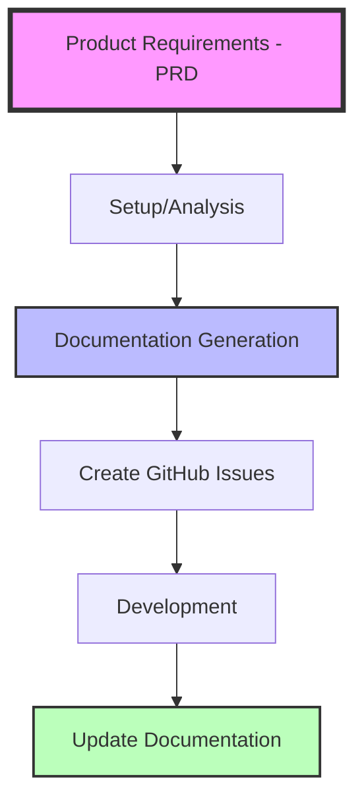

# Agent Documentation Template

A lightweight documentation template for AI-assisted software development that provides structured documentation and basic setup tools.

## Overview

This template helps teams work with AI by providing:

- **Structured Documentation** - Organized docs/ folder with product and technical sections
- **Setup Command** - Quick project analysis and documentation generation
- **Plan Command** - GitHub issue creation from requirements
- **MCP Server Integration** - Context management with context7

## Key Features

- **Documentation Structure**: Organized `docs/` folder for all project documentation
- **Product Requirements**: Dedicated `docs/product/` folder for PRDs
- **Technical Documentation**: API and database references in `docs/tech/`
- **Quick Setup**: `/setup` command analyzes and documents existing codebases
- **Issue Planning**: `/plan` command creates GitHub issues from requirements
- **MCP Integration**: Context7 server for context management

## Getting Started

### For New Projects

1. **Copy this template** to your project repository
2. **Read CLAUDE.md** for usage instructions
3. **Create your first PRD** in `docs/product/[feature-name].md`
4. **Use the Plan command** to create GitHub issues: `/plan`

### For Existing Projects

1. **Copy this template** to your project repository
2. **Run the Setup command** to analyze and document your codebase: `/setup`
3. **Review generated documentation** in `docs/`

## Documentation Workflow

### Simple Development Flow



### 1. Requirements (PRD)

Create a Product Requirement Document in `docs/product/`:

```markdown
# PRD: User Authentication

Define what to build, user stories, and success criteria...
```

### 2. Project Setup

```
/setup
```

Analyzes your codebase and generates documentation in `docs/`

### 3. Issue Planning

```
/plan
```

Creates GitHub issues from your requirements

## Available Commands

### Claude Slash Commands

- `/setup` - Analyze codebase and generate documentation
- `/plan` - Create GitHub issues from requirements

Commands are defined in `.claude/commands/` as minimal reference files.

## Project Structure

```
project-root/
├── docs/                    # All documentation
│   ├── product/             # Product requirements
│   ├── tech/                # Technical docs
│   ├── guides/              # How-to guides
│   ├── prd/                 # Product requirement documents
│   ├── agents/              # Agent-related docs (if needed)
│   ├── system-overview.md   # Architecture
│   ├── CHANGELOG.md         # Version history
│   ├── RULES.md             # Development rules
│   └── INDEX.md             # Navigation hub
├── .claude/                 # Claude configuration
│   ├── commands/            # Slash command definitions
│   │   ├── plan.md          # GitHub issue creation
│   │   └── setup.md         # Project setup
│   ├── claude_project.json  # Claude project config
│   └── settings.json        # Claude settings
├── tasks/                   # Task tracking (if used)
├── CLAUDE.md                # Claude usage instructions
├── AGENTS.md                # Multi-agent guide (simplified)
└── README.md                # This file
```


## Documentation Structure

### Core Principles

1. **Documentation-First** - Start with clear requirements
2. **Single Source of Truth** - `docs/` contains all documentation
3. **Simple Organization** - Clear folder structure

### Documentation Folders

- `docs/product/` - Product requirements (PRDs)
- `docs/tech/` - Technical documentation
- `docs/guides/` - How-to guides
- `docs/prd/` - Product requirement documents
- `docs/agents/` - Agent-related documentation (if needed)
- `docs/system-overview.md` - Architecture overview
- `docs/INDEX.md` - Documentation navigation hub
- `docs/CHANGELOG.md` - Version history
- `docs/RULES.md` - Development rules

## Example: Search Feature

### Step 1: Create PRD

```bash
# Create PRD
echo "# PRD: Product Search..." > docs/product/product-search.md
```

### Step 2: Setup Project

```bash
# Analyze and document codebase
/setup
```

### Step 3: Plan Development

```bash
# Create GitHub issues
/plan
```

## Best Practices

1. Write clear PRDs with specific requirements
2. Keep documentation up to date
3. Use `/setup` to understand existing codebases
4. Create GitHub issues with `/plan` for tracking

## Integration

### MCP Servers

- **Context7** - Context management and retrieval

## Quick Reference

| Need            | Command  | Creates                        |
| --------------- | -------- | ------------------------------ |
| Setup project   | `/setup` | Complete `docs/` structure     |
| Create issues   | `/plan`  | GitHub issues from requirements|


## Contributing

To improve this template:

1. Keep documentation organized
2. Update guides when adding features
3. Test commands before committing

## License

This template is provided as-is for use in your projects. Customize and adapt as needed.
